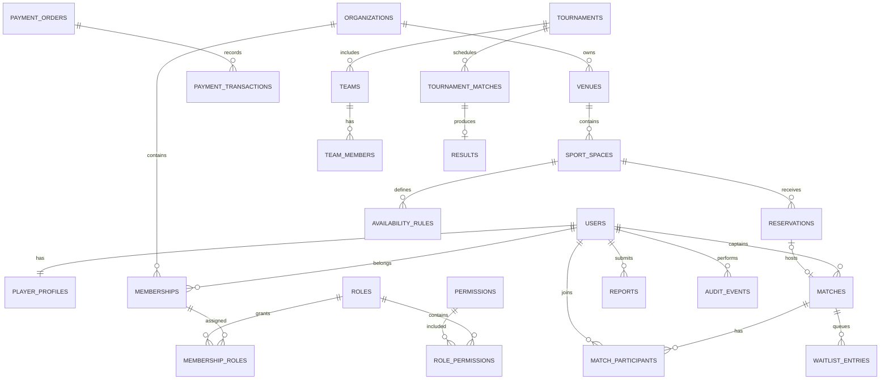

# 18. Modelo físico inicial de datos

## Convenciones

- PostgreSQL.
- Esquema inicial: `app`.
- Identificadores: `uuid` generados en backend o base.
- Fechas: `timestamptz` en UTC.
- Dinero: `bigint` en céntimos de PEN.
- Estados: `varchar` con `check` o tipos controlados por código; evitar enums PostgreSQL difíciles de evolucionar al inicio.
- Auditoría básica: `created_at`, `updated_at`, `created_by`, `updated_by` cuando corresponda.
- Versionado optimista: columna `version bigint` en agregados con edición concurrente.
- Identidad externa: `identity_subject`, nunca correo como identificador.

## Diagrama entidad-relación

## Identidad y perfiles

### `users`

| Columna | Tipo | Regla |
|---|---|---|
| `id` | uuid | PK |
| `identity_subject` | varchar(128) | unique, not null; `sub` de Keycloak |
| `email` | varchar(320) | nullable, normalizado, no PK |
| `email_verified` | boolean | not null default false |
| `display_name` | varchar(120) | not null |
| `status` | varchar(30) | ACTIVE, SUSPENDED, DELETED |
| `last_login_at` | timestamptz | nullable |
| `created_at` | timestamptz | not null |
| `updated_at` | timestamptz | not null |
| `version` | bigint | not null |

Índices: unique `identity_subject`; índice normalizado de email cuando no sea null.

### `player_profiles`

| Columna | Tipo | Regla |
|---|---|---|
| `user_id` | uuid | PK/FK users |
| `home_district_code` | varchar(30) | nullable |
| `bio` | varchar(500) | nullable |
| `avatar_object_key` | varchar(500) | nullable |
| `visibility` | varchar(30) | PRIVATE, PARTICIPANTS, PUBLIC |
| `onboarding_status` | varchar(30) | PENDING, COMPLETE |

Preferencias deportivas se modelarán con `player_sport_preferences(user_id, sport_code, level, positions_json)` para evitar columnas por deporte.

## Organizaciones y autorización

### `organizations`

`id`, `type`, `legal_name`, `display_name`, `slug`, `status`, `timezone`, auditoría y `version`.

Tipos iniciales: `SPORTS_COMPLEX`, `CLUB`, `TOURNAMENT_ORGANIZER`, `COMPANY`, `EDUCATIONAL_INSTITUTION`.

### `memberships`

| Columna | Tipo | Regla |
|---|---|---|
| `id` | uuid | PK |
| `organization_id` | uuid | FK, not null |
| `user_id` | uuid | FK, not null |
| `status` | varchar(30) | INVITED, ACTIVE, SUSPENDED, REVOKED |
| `invited_by` | uuid | nullable FK users |
| `activated_at` | timestamptz | nullable |

Constraint unique `(organization_id, user_id)`.

### RBAC

- `roles(id, code, name, scope_type, system_managed)`;
- `permissions(id, code, description)`;
- `role_permissions(role_id, permission_id)`;
- `membership_roles(membership_id, role_id, assigned_by, assigned_at)`.

Roles globales se resolverán mediante claims estables o una membresía especial de plataforma; no mezclar con roles de organización.

## Sedes, espacios y disponibilidad

### `venues`

`id`, `organization_id`, `name`, `slug`, `address`, `district_code`, `latitude`, `longitude`, `status`, contacto público, auditoría y `version`.

### `sport_spaces`

`id`, `venue_id`, `name`, `sport_code`, `format_code`, `capacity`, `surface_type`, `indoor`, `status`, auditoría y `version`.

### `availability_rules`

`id`, `sport_space_id`, `day_of_week`, `start_local_time`, `end_local_time`, `slot_minutes`, `price_minor`, `valid_from`, `valid_to`, `status`.

Excepciones: `availability_exceptions` para cierres, mantenimiento, feriados o precios especiales.

## Reservas

### `reservations`

| Columna | Tipo | Regla |
|---|---|---|
| `id` | uuid | PK |
| `organization_id` | uuid | denormalización segura para tenant |
| `sport_space_id` | uuid | FK |
| `customer_user_id` | uuid | FK obligatoria en la reserva web simple |
| `start_at` | timestamptz | not null |
| `end_at` | timestamptz | not null |
| `status` | varchar(30) | HOLD, PENDING_PAYMENT, CONFIRMED, COMPLETED, CANCELLED, EXPIRED |
| `total_minor` | bigint | >= 0 |
| `deposit_minor` | bigint | >= 0 y <= total |
| `expires_at` | timestamptz | nullable |
| `idempotency_key` | varchar(100) | obligatoria |
| `request_fingerprint` | char(64) | hash de campos semánticos para reintento seguro |
| `version` | bigint | optimistic lock |

Reglas:

- `end_at > start_at`;
- exclusión de solapamiento para estados que bloquean horario usando rango temporal PostgreSQL;
- unique por `(customer_user_id, idempotency_key)`;
- toda transición se registra en `reservation_status_history`.

`reservation_status_history` conserva tenant, reserva, estado anterior/nuevo, actor, motivo,
correlation ID e instante. La aplicación solo expone una operación append para este registro.

## Partidos

### `matches`

`id`, `organization_id` nullable, `captain_user_id`, `reservation_id` nullable, `sport_code`, `format_code`, `title`, `visibility`, `level_code`, `starts_at`, `duration_minutes`, `district_code`, `location_text`, `min_players`, `max_players`, `price_per_player_minor`, `status`, `rules_text`, auditoría y `version`.

Constraints:

- `max_players >= min_players`;
- ambos mayores que cero;
- costo no negativo;
- unique parcial de `reservation_id` cuando no sea null.

### `match_participants`

`id`, `match_id`, `user_id`, `participant_role`, `status`, `payment_status`, `joined_at`, `cancelled_at`, `attendance_status`, `version`.

Unique `(match_id, user_id)`.

Estados: `REQUESTED`, `CONFIRMED`, `CANCELLED`, `REMOVED`, `ATTENDED`, `NO_SHOW`.

### `waitlist_entries`

`id`, `match_id`, `user_id`, `position`, `status`, `created_at`, `promoted_at`.

Unique `(match_id, user_id)` y `(match_id, position)` para entradas activas.

## Pagos

### `payment_orders`

`id`, `payer_user_id`, `organization_id` nullable, `purpose_type`, `purpose_id`, `amount_minor`, `currency`, `status`, `external_reference`, `idempotency_key`, auditoría y `version`.

### `payment_transactions`

`id`, `payment_order_id`, `provider`, `provider_transaction_id`, `type`, `amount_minor`, `status`, `occurred_at`, `payload_hash`, `created_at`.

Unique `(provider, provider_transaction_id)` y control de idempotencia.

## Torneos

- `tournaments`: organización, deporte, modalidad, fechas, reglas, estado;
- `teams`: torneo, nombre, delegado, estado de inscripción;
- `team_members`: equipo, usuario, dorsal, estado y validación;
- `tournament_matches`: jornada, local, visitante, sede, hora y estado;
- `results`: marcador, estado de aprobación, registrado/aprobado por;
- `sanctions`: persona/equipo, tipo, motivo, vigencia.

## Operación transversal

### `notifications`

`id`, `recipient_user_id`, `channel`, `template_code`, `payload_json`, `status`, `attempt_count`, `next_attempt_at`, `sent_at`.

### `reports`

`id`, `reporter_user_id`, `target_type`, `target_id`, `reason_code`, `description`, `status`, `assigned_to`, resolución y auditoría.

### `audit_events`

`id`, `occurred_at`, `actor_user_id`, `organization_id`, `action`, `resource_type`, `resource_id`, `result`, `correlation_id`, `source_ip_hash`, `metadata_json`.

No incluir secretos ni contenido personal innecesario en `metadata_json`.

## Migraciones iniciales propuestas

1. `V001__create_identity_and_profiles.sql`
2. `V002__create_organizations_and_rbac.sql`
3. `V003__create_venues_and_spaces.sql`
4. `V004__create_reservations.sql`
5. `V005__create_matches_and_participants.sql`
6. `V006__create_payment_orders.sql`
7. `V007__create_tournaments.sql`
8. `V008__create_notifications_reports_audit.sql`

El orden puede ajustarse antes de la primera migración publicada. Una migración aplicada no se edita.
