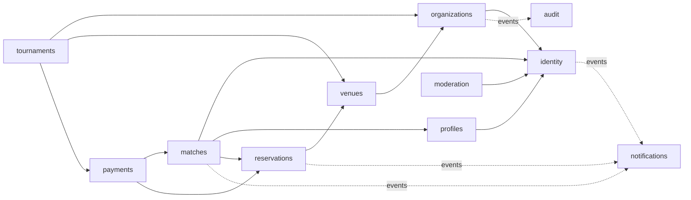

# 20. Diseño modular de Spring Boot

## Estrategia

Monolito modular con un único despliegue inicial y límites de dominio comprobables. Se recomienda Spring Modulith para documentar/verificar dependencias internas, sin convertirlo en requisito de negocio.

## Módulos

| Módulo | Agregado principal | Responsabilidad |
|---|---|---|
| `identity` | User | sincronizar identidad externa y estado local |
| `profiles` | PlayerProfile | perfil y preferencias deportivas |
| `organizations` | Organization | tenants, memberships, roles y permisos |
| `venues` | Venue/SportSpace | sedes, canchas, disponibilidad y precios |
| `reservations` | Reservation | holds, confirmación, cancelación y conflicto |
| `matches` | Match | publicación, cupos, participantes y espera |
| `payments` | PaymentOrder | obligaciones, transacciones y conciliación |
| `tournaments` | Tournament | equipos, fixture, resultados y sanciones |
| `notifications` | Notification | plantillas, canales y reintentos |
| `moderation` | Report | reportes, bloqueos e incidencias |
| `audit` | AuditEvent | trazabilidad sensible |
| `engagement` | Promotion/CustomerSegment | promociones, consentimiento y vistas derivadas de fidelización |
| `partners` | PartnerCampaign | comercios aliados, campañas y métricas agregadas |

## Dependencias permitidas



La flecha sólida `A → B` significa que A consume la API pública de B. La flecha punteada representa publicación/consumo de eventos, nunca acceso al repositorio interno.

## Reglas entre módulos

- cada módulo posee sus tablas y repositorios;
- referencias externas se conservan como IDs;
- consultas compuestas usan servicios de lectura explícitos;
- eventos internos para notificaciones y auditoría;
- no crear ciclos entre módulos;
- una transacción no debe abarcar integraciones externas;
- usar outbox cuando la confiabilidad de eventos lo requiera.

El módulo `engagement` continúa como límite futuro. La iteración inicial de `partners` comenzó por
DEC-2026-09-09 con un directorio administrado exclusivamente por `PLATFORM_ADMIN`; todavía no incluye
campañas, cobros publicitarios ni métricas. La sincronización de calendario será un adaptador de notificaciones o
reservas, y nunca una fuente de verdad paralela.

El panel de `matches` consulta partidos publicados por `organizer_user_id` y expone el padrón de cada
partido solo a su organizador. Incluye ocupación, lista de espera, ingresos confirmados y fecha/método de
pago. El organizador puede retirar inscripciones sin pago; una inscripción pagada queda protegida para
preservar la conciliación y el historial financiero. Todas las retiradas y promociones quedan auditadas.

## Paquete por módulo

```text
reservations
├── api
│   ├── ReservationController
│   ├── CreateReservationRequest
│   └── ReservationResponse
├── application
│   ├── CreateReservationUseCase
│   ├── CancelReservationUseCase
│   ├── ReservationAuthorization
│   └── port
├── domain
│   ├── Reservation
│   ├── ReservationStatus
│   ├── ReservationPolicy
│   └── event
└── infrastructure
    ├── persistence
    ├── security
    └── scheduler
```

## Capas

### API

- valida estructura y transforma DTOs;
- no contiene reglas de negocio;
- usa Problem Details;
- no expone JPA.

### Application

- orquesta casos de uso;
- define transacciones;
- aplica autorización contextual antes de escribir;
- publica eventos de dominio.

### Domain

- protege invariantes y transiciones;
- no depende de Spring MVC, JPA o Keycloak;
- utiliza value objects para dinero, rango de tiempo y estados.

### Infrastructure

- implementa repositorios y adaptadores;
- contiene configuración técnica;
- traduce proveedores externos al lenguaje del dominio.

## Seguridad transversal

- `SecurityFilterChain`: protección HTTP por defecto;
- `JwtDecoder`: issuer/audience/algoritmos;
- `@EnableMethodSecurity`;
- `CurrentActor`: identidad normalizada desde `sub`;
- `AuthorizationService`: tenant, permiso y propiedad;
- anotaciones propias solo si simplifican y son probables;
- pruebas unitarias e integración de decisiones.

## Transacciones críticas

### Reserva

1. validar disponibilidad;
2. intentar insertar rango bloqueante;
3. constraint resuelve carrera;
4. traducir violación a 409;
5. registrar historial/evento.

### Cupo

1. bloquear/actualizar agregado Match con versión;
2. verificar cupo activo;
3. insertar participante unique;
4. si está lleno, crear espera;
5. commit antes de notificar.

## Configuración

- configuración tipada mediante `@ConfigurationProperties`;
- perfiles solo para diferencias de ambiente;
- secretos fuera de YAML versionado;
- `ddl-auto=validate` en ambientes compartidos;
- Actuator expone únicamente endpoints necesarios y protegidos.
