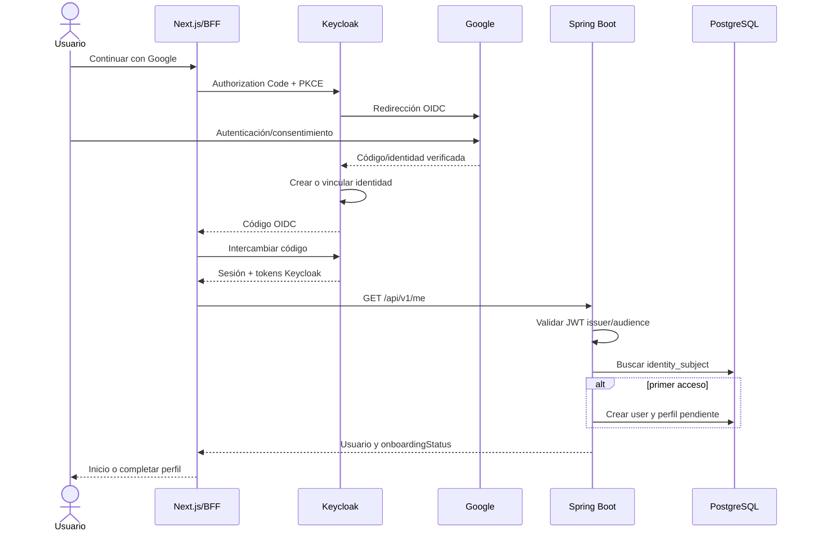
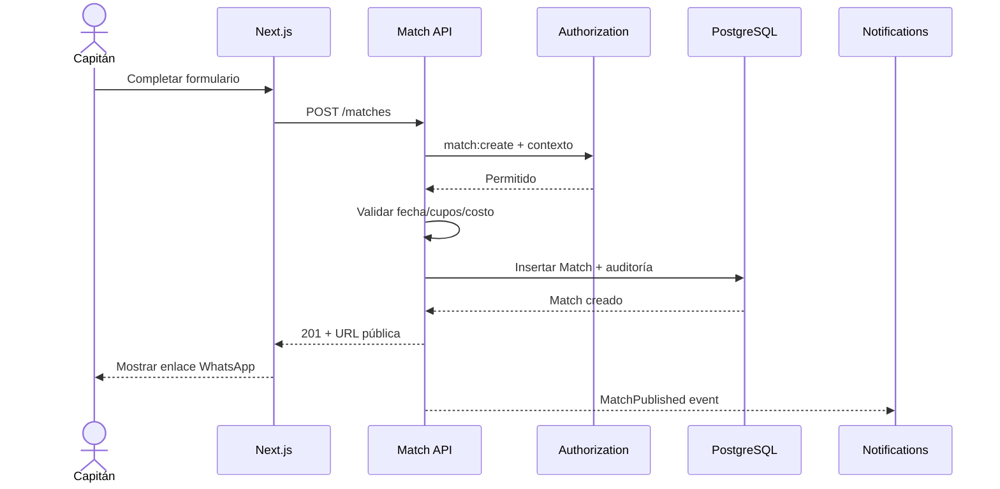
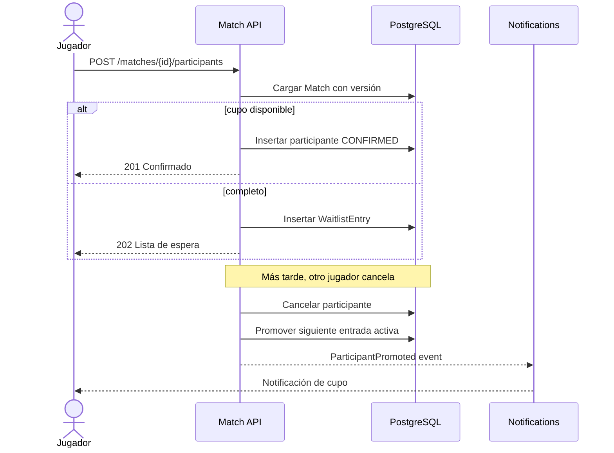
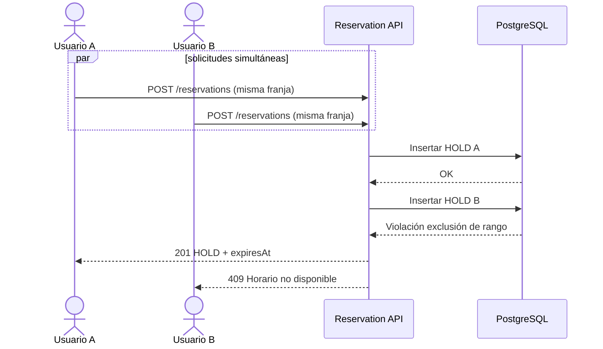
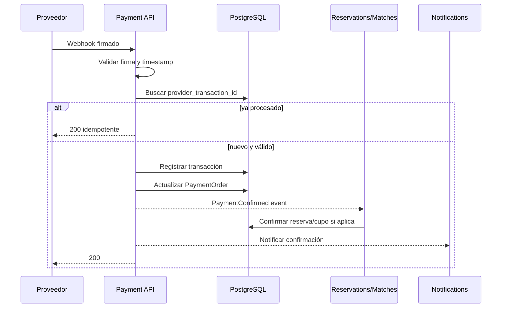
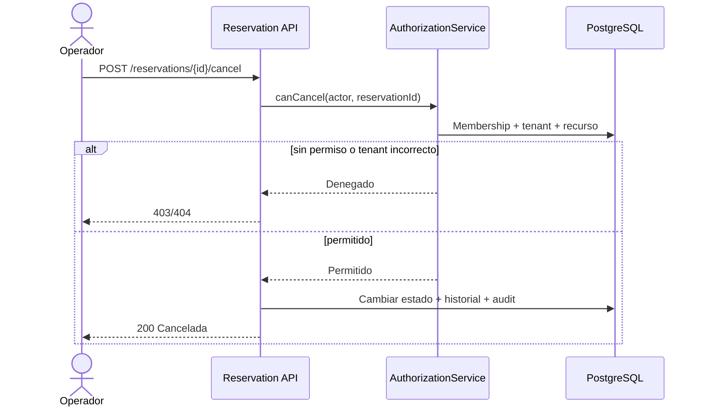

# 21. Diagramas de secuencia

## Registro e inicio con Google

## Crear y compartir partido

## Unirse, lista de espera y reemplazo

## Reserva concurrente

## Confirmación de pago por webhook futuro

## Cancelación con autorización contextual

